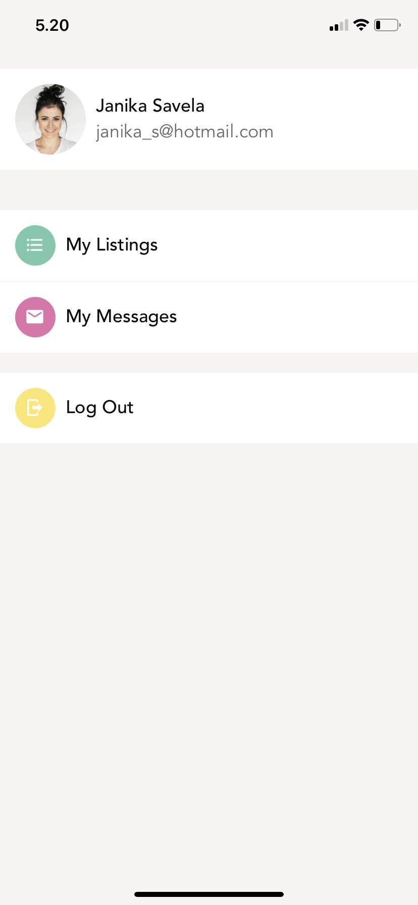

# DogHub
Oma mobiilikehitys projektini, jota olen työstänyt aina kun ylimääräistä aikaa on. Olen tehnyt tätä jonkin verran Mosh Hamedanin videoiden ja tutoriaalien pohjalta, hänen maksullisen react-native kurssin mukaan, jotta tulisi oppia ammattimaisesta puhelinsovelluksen kehittämisestä. ( https://codewithmosh.com/p/the-ultimate-react-native-course ) Koko kurssin videot katsoin läpi, ja sen jälkeen jatkanut koodin kehitystä omilleen haluamaani suuntaan. Olen projektin yhteydessä myös tutustunut Firebasen käyttöön, lähinnä perehtynyt Firestoren Databaseen sekä Storageen. 

Ideana on siis luoda puhelinsovellus koiran omistajille, jossa voi verkostoitua muiden koiran omistajien kanssa. Aloittaa keskusteluja, myydä/ostaa tavaroita, etsiä harrastuskavereita ja sovelluksessa olisi myös kartta, johon voisi merkkailla koiraystävällisiä paikkoja, ja niistä omia kokemuksia. Tarkoituksena kehitellä tätä eteenpäin, kun ylimääräistä aikaa on, on vielä kesken. Tällä hetkellä esim tietokanta yhteys jo hyvin toimii, ja kuvien tallennus ja näkyminen sovelluksessa.  

