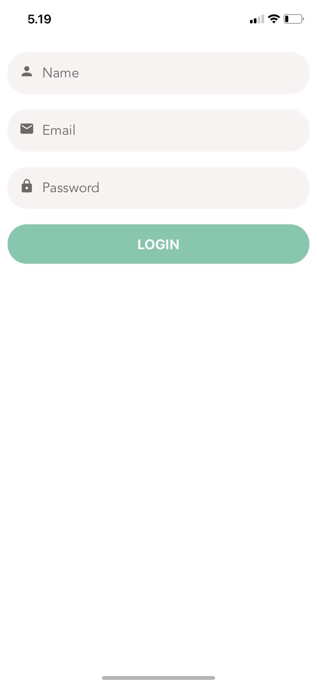

# DogHub

Tarkoituksena kehittää tätä vielä eteenpäin aina kun aikaa on, on vielä kesken. Tehdä siis puhelinsovellus koiran omistajille, jossa voi aloittaa keskusteluja, myydä/ostaa tavaroita, merkata karttaan koiraystävällisiä paikkoja sekä kokemuksia niistä jne jne.. Vähän värkkäillä oppimisen vuoksi ominaisuuksia mitä nyt keksiikin tuonne. Tällä hetkellä komponentointi sun muu aika hyvin tehty, useita näyttöjä ja ui on puhelinsovellukselle sopiva ja näyttää kivalta. Paikannusta kerkesin sen verran kokeilla aloittaa että kun käyttäjä vaikkapa postaa jonkun tuotteen myytäväksi tulisi ilmoitukseen automaattisesti sijainti, mutta mulla herjas kokoajan erroria toi expo-cli ja ei alkanut sitä expo-location kirjastoa lisäämään niin pitää tehdä se myöhemmin loppuun. Tällaista virhettä antoi kokoajan ja meinasi koko koodi kaatuilla (silti ei onnistunut asentaa uudempaa versiota kun sitäkin herjas): 

WARNING: The legacy expo-cli does not support Node +17. Migrate to the new local Expo CLI: https://blog.expo.dev/the-new-expo-cli-f4250d8e3421.
┌───────────────────────────────────────────────────────────────────────────┐
│                                                                           │
│   The global expo-cli package has been deprecated.                        │
│                                                                           │
│   The new Expo CLI is now bundled in your project in the expo package.    │
│   Learn more: https://blog.expo.dev/the-new-expo-cli-f4250d8e3421.        │
│                                                                           │
│   To use the local CLI instead (recommended in SDK 46 and higher), run:   │
│   › npx expo <command>                                                    │
│                                                             
Api yhteyttä myös vähän aloittelin mutta sekään ei vielä ole toiminnassa täysin, sisäänkirjautumisessa menee tiedot backendiin (LoginScreen.js), muut osat vielä tekemättä. Aloin hieman turhan laajaa tekemään, olen tätä tehnyt Mosh Hamedanin videoiden ja tutoriaalien pohjalta pala kerrallaan hänen  maksullisen react-native kurssin myötä sekä katsonut myös youtube videoita. https://codewithmosh.com/p/the-ultimate-react-native-course Tarkoituksena tosiaan tehdä pikkuhiljaa tätä tässä aina kun aikaa on että voipi sitten laittaa cv:hen kun alkaa vaikka harkkapaikkoja hakemaan. 

